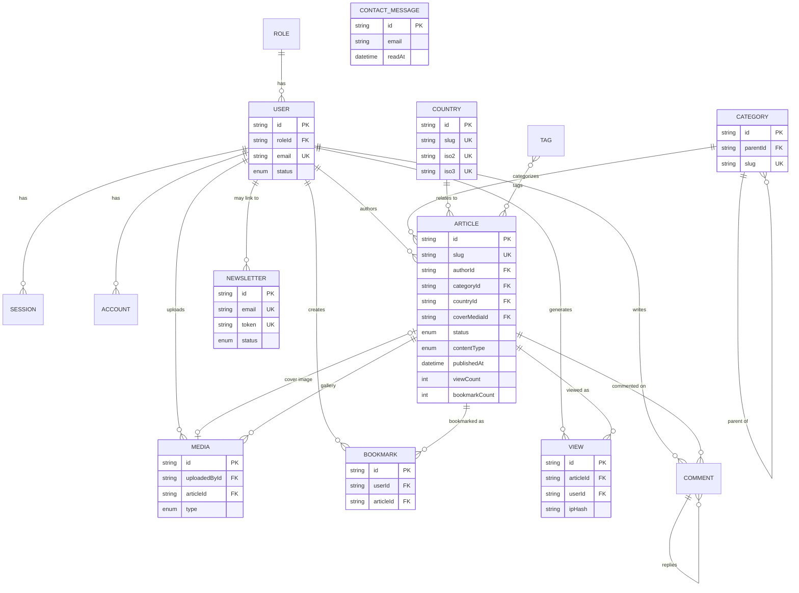

# Database

PostgreSQL via Prisma 7, using the `prisma-client` generator (output to `src/generated/prisma`, gitignored) and the `@prisma/adapter-pg` driver adapter. Schema source of truth: [`prisma/schema.prisma`](../prisma/schema.prisma).

## Schema overview, by domain

**Identity & Auth** (`Role`, `User`, `Session`, `Account`, `Verification`) — `Session`/`Account`/`Verification` are Better Auth's own tables (managed by the `prismaAdapter`, not hand-written queries). `User.roleId` drives both admin access (`ADMIN_ACCESS_ROLES`) and self-signup, which is hard-pinned to the `READER` role via a `databaseHooks.user.create.before` hook in `src/lib/auth/index.ts` — `ADMIN`/`EDITOR`/`AUTHOR` accounts are seed/DB-provisioned only.

**Taxonomy** (`Country`, `Category`, `Tag`) — `Country` is a flat profile table (197 seeded rows: name, ISO codes, region, economy/travel/history prose, `interestingFacts[]`). `Category` is self-referential (`parentId`) for arbitrary hierarchy — this is also the intended home for Guide subject taxonomy (Visa, Travel, Economy, Education, Healthcare, Technology, AI are just `Category` rows, not separate models).

**Content** (`Article`, `Media`) — `Article.contentType` (`ARTICLE` | `GUIDE`, default `ARTICLE`) toggles the Guide-specific rendering path (table of contents, Guide badge) while reusing every other field. `Article.status` (`DRAFT`/`IN_REVIEW`/`PUBLISHED`/`ARCHIVED`) plus `publishedAt` drives the scheduling model — there's no separate "scheduled" status; a `PUBLISHED` article with a future `publishedAt` is computed as scheduled at query time (`publishedWhere()` in `src/lib/queries/articles.ts`). `Media` backs both article covers (1:1 via `coverMediaId`) and gallery images (1:many).

**Engagement** (`Bookmark`, `View`, `Comment`, `Newsletter`, `ContactMessage`) — `Bookmark` is a simple join table with a denormalized `Article.bookmarkCount` kept in sync via `$transaction` in `src/lib/actions/bookmarks.ts`. `View` is a per-visit log (`articleId`, optional `userId`, hashed IP, user agent, timestamp) that powers reading history and the admin Analytics "recent activity" feed, alongside the denormalized `Article.viewCount`. `Newsletter` supports double opt-in via a nullable `token` (rotated on each confirm). `ContactMessage` backs the `/contact` form and its admin inbox.

> **Not yet wired to UI**: the `Comment` model and the `EDITOR`/`AUTHOR` roles exist in the schema but have no admin surface or public UI built against them yet — see `docs/ROADMAP.md`.

## Entity-relationship diagram

## Migration workflow

- **Local development**: `npm run prisma:migrate` (wraps `prisma migrate dev`) — creates a new migration file from schema changes and applies it immediately.
- **Production**: run `prisma migrate deploy` (not `migrate dev`) as a release step before the new app version starts serving traffic — it applies pending migrations without prompting or generating new ones. See `docs/DEPLOYMENT.md`.
- **Client regeneration**: `npm run prisma:generate` after any schema change (also runs automatically as part of `prisma migrate dev`).
- **Seeding**: `npm run prisma:seed` (wraps `prisma db seed`, configured in `prisma.config.ts`) — seeds roles, an admin user (from `ADMIN_NAME`/`ADMIN_EMAIL`/`ADMIN_PASSWORD` env vars), 197 countries, categories, tags, and demo articles. Safe to re-run (idempotent upserts).

## Indexes

- `Article`: `@@index([status, publishedAt])` — backs every public list query's `publishedWhere()` filter.
- `View`: `@@index([articleId, viewedAt])` — backs reading-history and recent-activity queries.
- `Comment`: `@@index([articleId, status])`.
- `Verification`: `@@index([identifier])` (Better Auth).

No full-text search index exists yet — `src/lib/queries/search.ts` uses `contains`/`insensitive` scans. See the Scalability section of `docs/ROADMAP.md` for the upgrade path (Postgres `tsvector`/GIN index) if search traffic grows.
